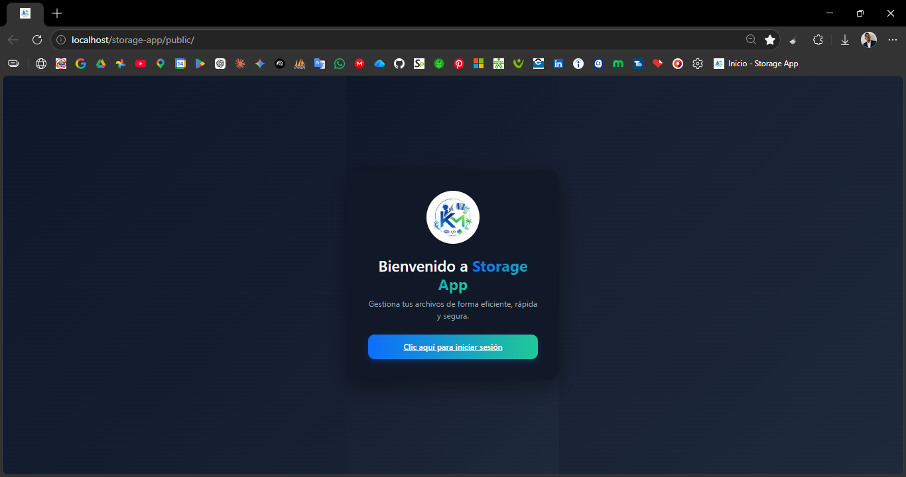
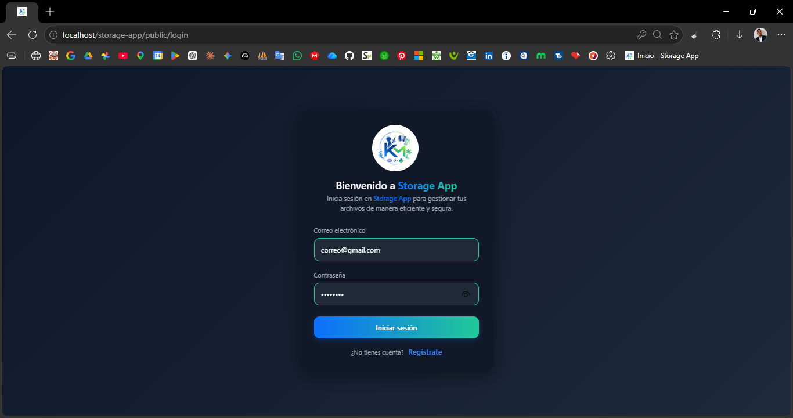
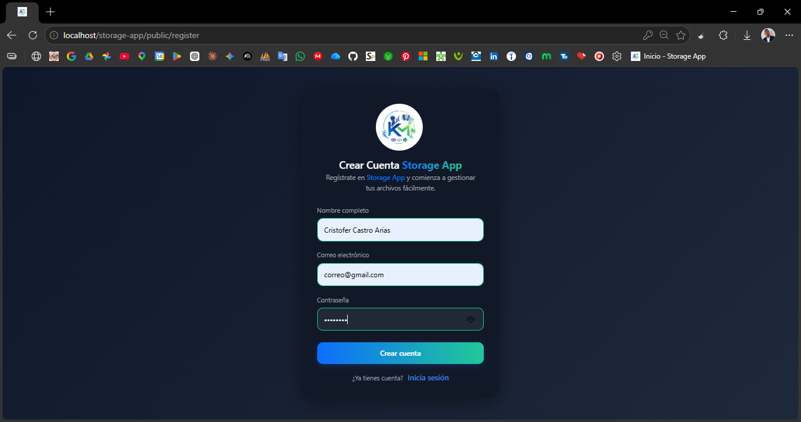
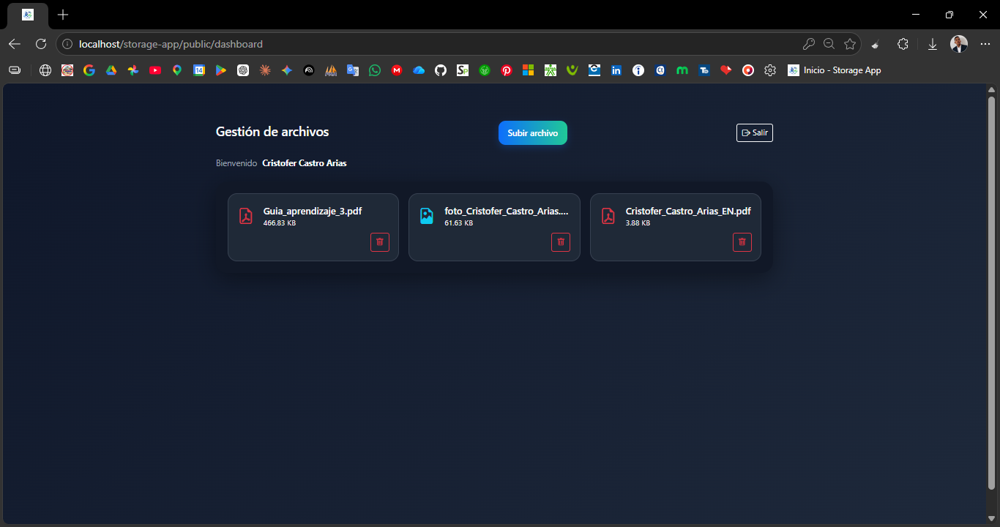
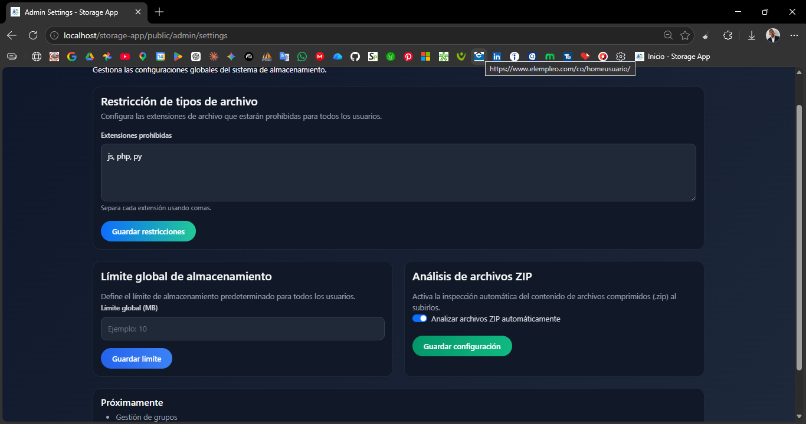

# 📦 Storage App

Aplicación web de almacenamiento de archivos desarrollada en PHP puro y JavaScript Vanilla, con arquitectura MVC personalizada, sistema de autenticación, control de roles y validaciones de seguridad en el backend.

---

## 🚀 Estado del proyecto

⚠️ En desarrollo activo.

**Módulos completados:**

- Sistema de autenticación (registro, login, logout)
- Dashboard de usuario con gestión de archivos
- Subida, listado, descarga y eliminación de archivos
- Validación de extensiones prohibidas (incluyendo contenido de archivos ZIP)
- Control de cuota de almacenamiento por usuario
- Router MVC personalizado con separación de rutas web y API
- Panel de administración con restricción de extensiones
- Sistema de roles (admin / usuario)
- Protección de rutas por autenticación y rol

**En desarrollo:**

- Refactor del módulo de login y registro (migración a AuthModel)
- Gestión de cuota dinámica desde el panel de admin
- Sistema de grupos y roles avanzados
- Lógica extendida del panel de administración

---

## 📌 Descripción

Storage App es una aplicación web para gestionar archivos de forma segura. Los usuarios pueden subir, listar, descargar y eliminar sus archivos. El sistema aplica validaciones desde el backend: extensiones bloqueadas, inspección del contenido de ZIPs, y límite de almacenamiento por usuario.

El proyecto fue desarrollado siguiendo una arquitectura MVC personalizada en PHP orientado a objetos, con JavaScript Vanilla (ES6+) y Fetch API para el manejo asíncrono de peticiones y renderizado dinámico de la interfaz, sin dependencia de frameworks externos.

---

## ⚙️ Tecnologías utilizadas

### Backend
- PHP 8+ (POO)
- MySQL
- PDO con prepared statements reales (`ATTR_EMULATE_PREPARES = false`)
- Arquitectura MVC personalizada

### Frontend
- HTML5 / CSS3
- JavaScript Vanilla (ES6+)
- Fetch API

### UI
- Bootstrap 5
- SweetAlert2
- Bootstrap Icons

### Entorno de desarrollo
- XAMPP
- Apache con `.htaccess` para URL rewriting

---

## ✨ Funcionalidades implementadas

- Registro e inicio de sesión con validaciones en backend
- Regeneración de ID de sesión en login (protección contra session fixation)
- Cierre de sesión con destrucción completa de cookie y sesión
- Dashboard protegido por sesión
- Subida de archivos con validación de extensiones bloqueadas
- Inspección del contenido de archivos ZIP para detectar extensiones prohibidas dentro
- Control de cuota de almacenamiento por usuario (límite de 10 MB)
- Resolución automática de nombres duplicados (`archivo (1).pdf`, `archivo (2).pdf`, etc.)
- Listado de archivos del usuario con iconos por tipo
- Descarga segura de archivos (acceso verificado por sesión y propiedad)
- Eliminación de archivos con confirmación y transacción BD + filesystem
- Panel de administración protegido por rol
- Configuración de extensiones bloqueadas desde el panel admin
- Router personalizado con rutas web (vistas) y rutas API (JSON)
- Respuestas JSON estandarizadas para todas las peticiones asíncronas
- Separación de carpetas de almacenamiento por usuario usando `external_id` (sin exponer IDs internos)

---

## 🔐 Seguridad implementada

- Contraseñas hasheadas con `password_hash()` / `password_verify()`
- Queries con PDO y prepared statements reales (protección contra SQL injection)
- `session_regenerate_id(true)` en cada login
- Destrucción completa de sesión y cookie en logout
- `external_id` aleatorio (`bin2hex(random_bytes(16))`) para aislar carpetas de usuario
- Rutas de almacenamiento fuera del directorio `public/`
- Validación de extensiones en el servidor (no solo en cliente)
- Inspección recursiva del contenido de ZIPs
- Rutas admin protegidas por autenticación + verificación de `role_id`
- Mensajes de error genéricos al usuario (sin exponer trazas ni SQLSTATE)

---

## 📁 Estructura del proyecto

```
storage-app/
│
├── app/
│   │   .htaccess                        # Bloquea acceso directo a /app
│   │
│   ├── controllers/
│   │   ├── api/                         # Controladores API (respuestas JSON)
│   │   │   ├── AdminSettingsController.php
│   │   │   ├── AuthController.php
│   │   │   └── FileController.php
│   │   │
│   │   └── web/                         # Controladores para renderizado de vistas
│   │       ├── AdminSettingsController.php
│   │       ├── DashboardController.php
│   │       └── PageController.php
│   │
│   ├── core/                            # Núcleo del mini framework MVC
│   │   ├── Controller.php               # Clase base con métodos comunes
│   │   ├── Router.php                   # Enrutador y dispatcher
│   │   └── View.php                     # Renderizador de vistas con layout
│   │
│   ├── helpers/                         # Utilidades estáticas reutilizables
│   │   └── FileHelper.php               # Extensión, nombre único, formato de tamaño
│   │
│   ├── models/                          # Acceso a base de datos
│   │   ├── AuthModel.php                # Queries de autenticación y usuarios
│   │   └── FileModel.php                # Queries de archivos y extensiones bloqueadas
│   │
│   └── services/                        # Lógica de negocio
│       ├── AdminSettingService.php
│       ├── AuthService.php
│       ├── FileService.php
│       │
│       └── handlers/
│           └── StorageHandler.php       # Gestión física del filesystem
│
├── config/
│   ├── app.php                          # Constantes globales (BASE_URL, ROOT_PATH)
│   └── db_connection.php               # Clase Database con configuración PDO
│
├── docs/
│   └── screenshots/                     # Capturas de pantalla de la aplicación
│
├── logs/
│   └── debug.log                        # Registro de errores internos
│
├── postman/                             # Colecciones y entornos para pruebas de API
│   ├── collections/
│   ├── environments/
│   └── globals/
│
├── public/                              # Único directorio accesible desde el navegador
│   │   .htaccess                        # Rewrite rules para el front controller
│   │   index.php                        # Front controller — punto de entrada único
│   │
│   ├── css/
│   │   ├── admin/
│   │   ├── auth/
│   │   └── files/
│   │
│   ├── img/
│   │
│   └── js/
│       ├── admin/
│       ├── auth/
│       ├── files/
│       └── main.js                      # Configuración global (Toast, BASE_URL, iconos)
│
├── sql/
│   └── consultas.sql                    # Scripts SQL iniciales (roles, usuario admin, tablas)
│
├── storage/
│   └── uploads/                         # Archivos subidos (fuera del webroot)
│       └── {external_id}/               # Carpeta aislada por usuario
│
├── views/
│   ├── admin/
│   │   └── settings.php
│   ├── layouts/
│   │   └── main.php                     # Layout principal compartido
│   ├── dashboard.php
│   ├── home.php
│   ├── login.php
│   └── register.php
│
├── .gitignore
└── README.md
```

---

## 🧠 Arquitectura

Arquitectura MVC personalizada implementada desde cero en PHP puro, sin frameworks externos. Inspirada en patrones de frameworks modernos como Laravel pero sin sus dependencias.

### Flujo de una petición

```
index.php → Router → Controller → Service → Model → DB
                                          ↓
                                     StorageHandler (filesystem)
```

### Capas y responsabilidades

| Capa | Responsabilidad |
|---|---|
| **Router** | Recibe la URL, valida el verbo HTTP y despacha al controller correcto |
| **Controllers/web** | Verifican autenticación y renderizan vistas |
| **Controllers/api** | Verifican autenticación/rol y retornan JSON |
| **Services** | Contienen toda la lógica de negocio (validaciones, reglas, orquestación) |
| **Models** | Ejecutan las queries a la BD y retornan datos crudos |
| **Helpers** | Funciones utilitarias estáticas reutilizables entre servicios |
| **StorageHandler** | Gestiona las operaciones físicas sobre el filesystem |
| **View / Layout** | Renderizan las vistas PHP con datos inyectados |

### Separación de rutas

El router diferencia dos tipos de rutas:

- **Rutas web** → responden con vistas HTML renderizadas en el servidor
- **Rutas API** → responden con JSON para las peticiones asíncronas del frontend

---

## 🛠️ Instalación y configuración

### Requisitos

- PHP 8.0+
- MySQL 5.7+ o MariaDB
- Apache con `mod_rewrite` habilitado
- XAMPP (u otro entorno local equivalente)

### Pasos

1. Clonar o descomprimir el proyecto dentro del directorio de tu servidor local:
   ```
   /xampp/htdocs/storage-app/
   ```

2. Importar la base de datos. Crear primero la BD en tu gestor MySQL:
   ```sql
   CREATE DATABASE storage_app CHARACTER SET utf8mb4 COLLATE utf8mb4_unicode_ci;
   ```
   Luego ejecutar el script `sql/consultas.sql`.

3. Configurar la conexión a la base de datos en `config/db_connection.php`:
   ```php
   private string $host     = "localhost";
   private string $dbName   = "storage_app";
   private string $username = "root";
   private string $password = "";
   ```

4. Verificar que `BASE_URL` en `config/app.php` coincide con tu entorno:
   ```php
   define('BASE_URL', '/storage-app/public/');
   ```

5. Asegurarse de que `mod_rewrite` está activo en Apache y que el `.htaccess` de `public/` tiene permisos de lectura.

6. Acceder desde el navegador:
   ```
   http://localhost/storage-app/public/
   ```

### Usuario administrador de prueba

```
Email:    admin@test.com
Password: admin123
```

---

## 📡 Endpoints de la API

| Método | Ruta | Descripción | Auth requerida |
|---|---|---|---|
| `POST` | `/auth/register` | Registro de nuevo usuario | No |
| `POST` | `/auth/login` | Inicio de sesión | No |
| `POST` | `/auth/logout` | Cierre de sesión | Sí |
| `GET` | `/files/list` | Listar archivos del usuario | Sí |
| `POST` | `/files/upload` | Subir archivo | Sí |
| `POST` | `/files/delete` | Eliminar archivo | Sí |
| `GET` | `/files/download?id={id}` | Descargar archivo | Sí |
| `GET` | `/settings/file-restrictions` | Obtener extensiones bloqueadas | Admin |
| `POST` | `/settings/file-restrictions/save` | Actualizar extensiones bloqueadas | Admin |

Todas las respuestas tienen la estructura:

```json
{
  "status": true,
  "message": "Descripción del resultado",
  "data": null
}
```

---

## 📸 Capturas de la aplicación

### 🏠 Home
Vista principal de bienvenida.



---

### 🔐 Login
Pantalla de inicio de sesión.



---

### 📝 Registro
Formulario de registro de nuevos usuarios.



---

### 📂 Dashboard
Panel del usuario para visualizar y gestionar sus archivos.



---

### ⚙️ Panel de administración
Configuración de extensiones de archivo restringidas.


